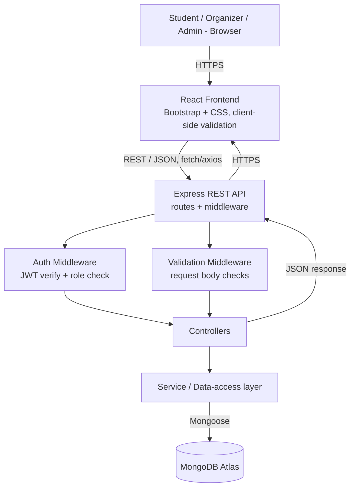
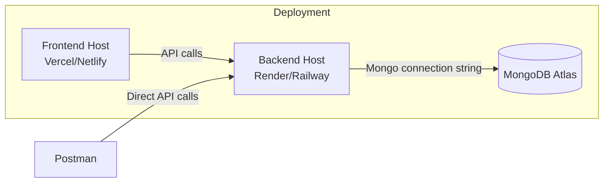

# ARCHITECTURE.md — College Event Planner
## System Architecture Document

*Consistent with `PRD.md` (functional requirements) and `research.md` §27, §35 (stack rationale). No implementation code included.*

---

## 1. Architecture Overview

The College Event Planner is a three-tier web application:

1. **Frontend** — a React single-page application, styled with Bootstrap/CSS, that consumes a REST API.
2. **Backend** — a Node.js runtime running an Express.js application that exposes the REST API, handles authentication/authorization, and performs server-side validation.
3. **Database** — MongoDB, accessed from the backend via Mongoose, storing all persistent data (users, events, clubs, registrations, results, photos, notifications).

**[RECOMMENDATION, verified against academic constraints]** This stack is not adopted blindly — it is verified sensible because: React genuinely needs to exist to demonstrate component-based client validation (Practical 03); a Node/Express backend genuinely needs to exist to demonstrate server-side validation and middleware (Practicals 04–05); a REST API genuinely needs to exist because the frontend and backend are separate processes that must communicate (Practical 06); and MongoDB is a genuine fit because event/registration/result documents have optional, evolving fields (Practical 07). No layer is present purely to satisfy the syllabus.

---

## 2. Architecture Diagram

---

## 3. Frontend Architecture

**Pages** (mapped 1:1 to `PRD.md` §10 MVP and the Information Architecture in research.md §14):
Home · Discover · Event Details · Clubs · Club Details · My Events · Organizer Dashboard (create/edit event, view registrants) · Admin Dashboard (approve/remove) · Login/Register.

**Components (reusable):** `EventCard`, `ClubCard`, `FilterBar`, `RegistrationForm`, `Navbar`, `ProtectedRoute` (role-gated route wrapper), `EventForm` (organizer create/edit, shared component).

**State management:** Local component state (`useState`) for form fields and UI state (loading/error/success); a lightweight global auth context (`useContext`) holding the logged-in user and role, since the app's data needs do not justify a heavier state library.

**Validation:** Controlled inputs with inline, field-level error messages, computed from simple validation functions run on submit and (for immediate feedback) on blur. This is the client-side layer described in `PRD.md` FR-006.

**API communication:** A small typed API-client module wrapping `fetch`/`axios`, one function per endpoint in `API.md`, attaching the JWT (if present) as an `Authorization: Bearer` header.

**Routing:** `react-router-dom`, with a `ProtectedRoute` wrapper that redirects unauthenticated users to Login and hides Organizer/Admin routes from students (this is the client-side half of the route-protection story; the server-side half is Express middleware, §4/§6 below).

---

## 4. Backend Architecture

**Routes** — one router file per resource: `routes/auth.js`, `routes/events.js`, `routes/clubs.js`, `routes/registrations.js` (mirrors `API.md`).

**Controllers** — one function per endpoint, responsible for calling the service layer and shaping the HTTP response; contain no direct database queries.

**Services / data-access layer** — Mongoose model calls live here (`services/eventService.js`, etc.), so controllers stay thin and testable, and so database logic isn't duplicated across controllers.

**Middleware:**
- `requireAuth` — verifies JWT, attaches `req.user`.
- `requireRole(role)` — checks `req.user.role` against an allowed list; used to protect organizer/admin routes.
- `validate(schema)` — request-body validation (e.g. with a schema-validation library or hand-written checks), returning `400` with field-level messages on failure.
- `errorHandler` — centralized Express error-handling middleware, converting thrown errors into the consistent JSON error shape defined in `API.md` §6.

**Validation:** All write endpoints run through `validate()` before reaching the controller — this is the server-side layer (`PRD.md` FR-007) and is independent of, and does not trust, any client-side validation.

**Error handling:** Controllers/services throw typed errors (e.g. `ValidationError`, `NotFoundError`, `ConflictError`, `AuthError`); the centralized `errorHandler` middleware maps each type to the correct HTTP status code and JSON shape.

---

## 5. Database Architecture

MongoDB is the sole persistence layer, accessed exclusively from the backend (the frontend never talks to MongoDB directly). Its role: durable storage for users, events, clubs, registrations, results, photos, and notifications, with Mongoose providing schema-level structure and validation on top of MongoDB's flexible document model. Full schema detail lives in `DATABASE.md` (kept as a separate document per the required doc set, and treated as authoritative for field-level detail).

---

## 6. Authentication

- **Registration:** `/api/auth/register` — student self-registers with name/email/password; organizer registration additionally captures a club association and starts in an unapproved state (`PRD.md` FR-026).
- **Login:** `/api/auth/login` — verifies credentials (bcrypt-compared password hash), issues a JWT containing `userId` and `role`.
- **Sessions:** Stateless JWT, sent by the client as a Bearer token on every authenticated request — chosen over server-side sessions because it keeps the backend stateless and simple, which suits both the academic scope and a serverless-friendly host like Render/Railway.
- **Authorization:** `requireRole('organizer')` / `requireRole('admin')` middleware gates event-creation, event-editing, registrant-list, and admin routes. Ownership checks (an organizer may only edit *their own* club's events) happen in the service layer by comparing `event.clubId` against the organizer's club.
- **Roles:** `student`, `organizer`, `admin` — exactly the three roles used throughout `PRD.md`, `DATABASE.md`, and `API.md`; no additional roles are introduced.

**[RECOMMENDATION]** Deliberately not over-engineered: no OAuth providers, no 2FA, no refresh-token rotation — a single JWT with a reasonable expiry (e.g. 7 days) is sufficient for an academic deployment (research.md §24).

---

## 7. Validation Architecture

Three distinct, independently-enforced layers — each with a different *purpose*, not redundant copies of the same check:

| Layer | Technology | Purpose | What it catches |
|---|---|---|---|
| **Client-side** | React | Fast feedback, good UX | Empty required fields, malformed email/phone, obviously wrong formats — *before* a network request is made |
| **Server-side** | Node/Express middleware | Trust boundary — the real authority | Everything client-side checks (re-verified, since the client can be bypassed), plus rules a client cannot enforce: capacity limits, deadline checks, duplicate-registration checks, authorization/ownership |
| **Database-level** | MongoDB / Mongoose schema | Last-resort data integrity | Required fields, type mismatches, unique-index violations (e.g. duplicate `eventId+userId` registration), even if application code has a bug |

This three-layer distinction is the explicit basis for Practical 02/03 (client) vs. Practical 04/05 (server) vs. Practical 07 (database) demonstrations — see `PRACTICAL_MAPPING.md`.

---

## 8. Security

- Passwords hashed with bcrypt before storage; plaintext never persisted or logged.
- JWT-based auth; token never stored in `localStorage` in a way that's exposed to XSS beyond what's typical for a course project (an httpOnly cookie is a stronger option if time allows, but a Bearer-token-in-memory/`localStorage` approach is acceptable for MVP given the scope).
- All write endpoints protected by `requireAuth`; role-specific endpoints additionally protected by `requireRole`.
- Server-side validation is mandatory on every write endpoint (§7) — never rely on the client alone.
- Organizer accounts require Admin approval before they can publish events, reducing fake/unauthorized event postings (`PRD.md` FR-026).
- Rate limiting/duplicate-guard on the registration endpoint (via the unique `(eventId, userId)` index, `DATABASE.md` §6) prevents accidental or scripted duplicate registrations.
- No payment data is ever collected (out of scope, `PRD.md` §4), removing an entire class of security concern for MVP.

**[RECOMMENDATION]** Explicitly not in scope: OAuth/SSO integration, 2FA, encryption-at-rest configuration beyond MongoDB Atlas defaults, formal penetration testing — appropriate for a student project (research.md §24).

---

## 9. Deployment Architecture

- **Frontend:** static React production build deployed to Vercel (or Netlify).
- **Backend:** Node/Express app deployed to Render or Railway, with environment variables for the MongoDB connection string and JWT secret.
- **Database:** MongoDB Atlas (free tier), reachable from the backend host via a connection string; IP allowlist or "allow from anywhere" for simplicity at this scale.
- **API testing:** Postman collection pointed at the deployed backend URL, so the API can be demonstrated live during the viva without requiring a locally running server (research.md §28).

This mirrors research.md §28 exactly; no deviation.

---

## 10. Scalability

Explicitly **not** a design priority for MVP, but for completeness: if this grew to serve a real multi-thousand-student campus, the changes that would matter are (a) adding pagination and indexed queries more aggressively on the event feed (already indexed per `DATABASE.md` §6, but query patterns would need monitoring), (b) moving from a single Node instance to multiple instances behind a load balancer, (c) introducing a caching layer (e.g. Redis) for the read-heavy event feed, and (d) separating notification delivery into an asynchronous queue rather than an inline call during the request/response cycle. None of this is built for MVP — it is documented here only to show the current architecture doesn't paint the project into a corner.

---

## 11. Technology-to-Practical Mapping

| Technology | Practical | Role in this architecture |
|---|---|---|
| HTML5 / CSS3 / Bootstrap | 01 | Structure and responsive layout of every page |
| JavaScript (vanilla, pre-React demo) | 02 | Standalone discovery/filter/validation demo over a static JSON array |
| ReactJS | 03 | Frontend framework; component structure, state, client-side validation |
| Node.js | 04 | Backend runtime; async request handling, server-side validation |
| Express.js | 05 | Routing, middleware (auth, validation, error handling) |
| REST API | 06 | Contract between frontend and backend; Postman-testable |
| MongoDB | 07 | Persistent storage for all application data |

Full detail, demonstration steps, and viva prep: `PRACTICAL_MAPPING.md`.
